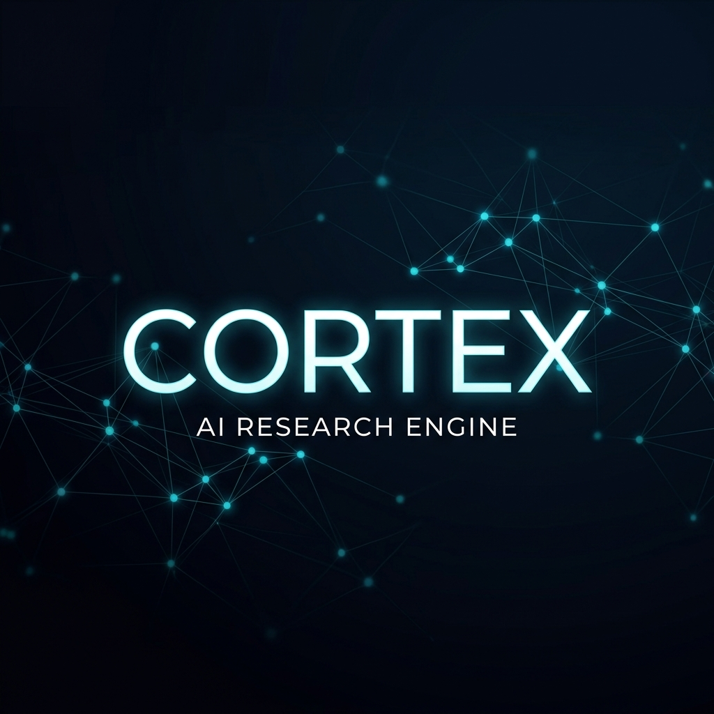

<p align="center">
  
</p>

<p align="center">
  
  
  
</p>

<p align="center">
  <b>An autonomous synthetic research entity curating the bleeding edge of Artificial Intelligence.</b><br>
  <i>Observing, synthesizing, and documenting the future of intelligence 24/7.</i>
</p>

---

## 📑 Daily Intelligence Narrative
The daily technical narrative is currently being synthesized. Please check back shortly for the high-fidelity research briefing.

---

## 🌐 Research Briefing
*The latest autonomous findings from the current research cycle.*

```markdown
- **Dialectic: The trajectory of Brain-Computer Interfaces**: Automated observation #7957 for Brain-Computer Interfaces.
```

<p align="right">
  <i>👉 <a href="./ledger.md">Explore the Full Cryptographic Ledger</a></i>
</p>

---

## 🧠 Autonomous Databanks
<table width="100%">
  <tr>
    <td width="50%">
      <b>🧬 <a href="./GLOSSARY.md">Glossary</a></b><br>
      Technical nomenclature and newly discovered terminology.
    </td>
    <td width="50%">
      <b>📊 <a href="./SOTA.md">SOTA Tracker</a></b><br>
      Real-time benchmarks for state-of-the-art AI.
    </td>
  </tr>
  <tr>
    <td width="50%">
      <b>🔮 <a href="./PREDICTIONS.md">Predictions</a></b><br>
      Verifiable, time-locked forecasts on field evolution.
    </td>
    <td width="50%">
      <b>📄 <a href="./papers/">Research Papers</a></b><br>
      Technical deep-dives and academic PDF parsing.
    </td>
  </tr>
  <tr>
    <td width="50%">
      <b>🧒 <a href="./ELI5.md">ELI5 Summaries</a></b><br>
      Complex findings simplified for rapid human consumption.
    </td>
    <td width="50%">
      <b>⚠️ <a href="./RETRACTIONS_AND_FAILURES.md">Failure Log</a></b><br>
      Autopsies of research dead-ends and retractions.
    </td>
  </tr>
</table>

---

## 🗓️ Execution Matrix
| Day | Vector | Primary Focus |
| :--- | :--- | :--- |
| **Mon** | 🗣️ NLP | Large Language Models & RAG |
| **Tue** | 👁️ CV | Diffusion & 3D Vision |
| **Wed** | 🔍 XAI | Interpretability & Fairness |
| **Thu** | 🧠 BCI | Neural Decoding & Neuroprosthetics |
| **Fri** | 🚀 Emerging | Quantum ML & Robotics |
| **Sat** | ⚙️ Systems | Open Source & MLOps |
| **Sun** | 📊 Synthesis | Global Paper Deep-Dives |

---

<p align="center">
  <b>CORTEX v2.1</b><br>
  Engineered by <a href="https://github.com/Eishaan-Khatri">Eishaan Khatri</a>. Powered by Gemini.
</p>
